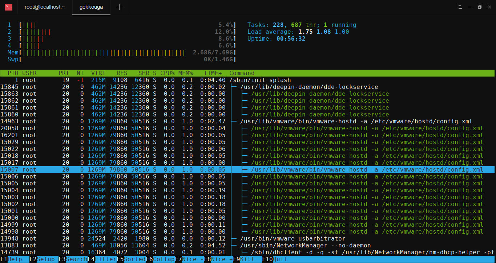
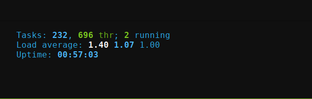
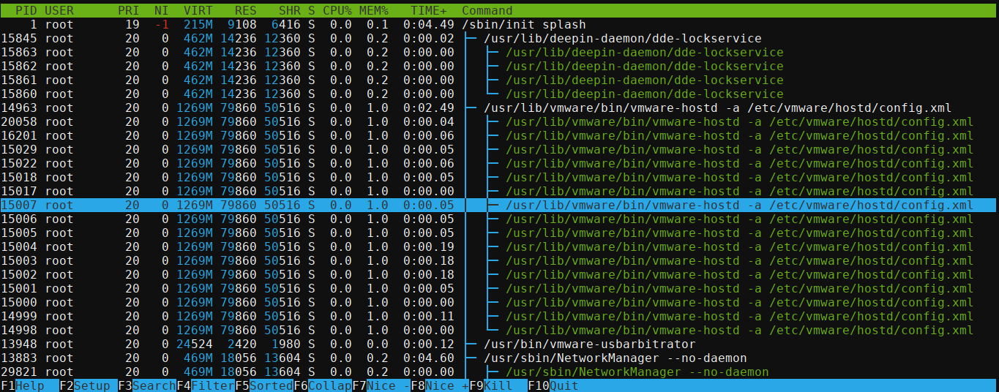
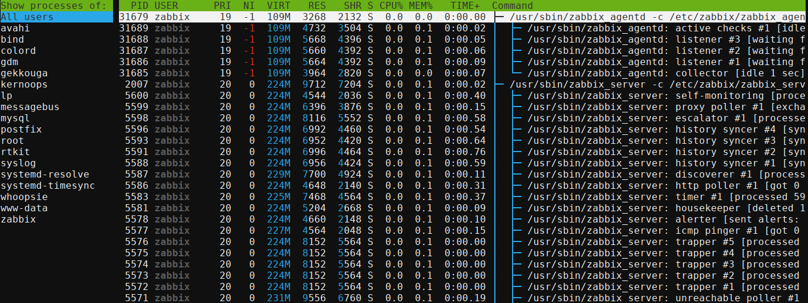

## Htop
#Cài đặt:

*Trên Ubuntu/Debian:

    apt-get install htop

*Trên RHEL/CentOS:

    yum install epel-release
    yum install htop

## Sử dụng: #htop

*Mức dùng CPU
Thanh tiến trình CPU thẻ hiện mức dùng CPU của hệ thống. Số lượng thanh tiến trình CPU tương ứng với số lượng CPU/Core của máy chủ. Thanh tiến trình bao gồm các màu khác nhau. Mỗi màu thể hiện một ý nghĩa riêng: ở đây là 4 thread

    Xanh lam: các tiến trình độ ưu tiên thấp
    Xanh lục: các tiến trình người dùng (user)
    Đỏ: các tiến hành hạt nhân (kernel)
    Vàng: thời gian IRQ
    Đỏ tươi: thời gian Soft IRQ
    Xám: thời gian chờ IO

* Mức dùng bộ nhớ RAM
Bên dưới thanh tiến trình CPU là thanh bộ nhớ RAM và Swap. Hai thanh này cũng có các màu sắc thể hiện một ý nghĩa:

    Xanh lục: bộ nhớ đã dùng
    Xanh dương: bộ nhớ đệm
    Vàng: bộ nhớ cache
    
* Tải trung bình

        Systemload hay còn gọi là load thể hiện số công việc hiện tại hệ thống đang thực thi
        Load everage cho ta thấy được trung bình khối lượng công việc hệ thống phải xử lý trong mỗi khoảng thời gian 1 phút, 5 phút và 15 phút
        

* Thông tin tiến trình

Htop sẽ liệt kê tất cả các tiến trình đang chạy trên hệ thống với các thông tin kèm theo như sau:

Ý nghĩa từng cột giá trị như sau:

    PID: Số PID của tiến trình. Mỗi tiến trình sẽ có PID riêng
    USER: Chủ sở hữu tiến trình
    PRI: Độ ưu tiên của tiến trình. Số càng thấp thì mức độ ưu tiên càng cao
    NI: Giá trị nice value của tiến trình, ảnh hưởng đến độ ưu tiên của tiến trình đó
    VIRT: Bộ nhớ ảo đang được sử dụng cho tiến trình
    RES: Bộ nhớ RAM vậy lý đang được sử dụng, đo bằng kylobytes
    SHR: Bộ nhớ chia sẻ mà tiến trình đang sử dụng
    S: Trạng thái hiện tại của tiến trình (zombied, sleeping, running, uninterruptedly sleeping, traced)
    % CPU: Phần trăm tài nguyên CPU đang được tiến trình sử dụng
    % MEM: Phần trăm bộ nhớ RAM đang được tiến trình sử dụng
    TIME +: Thời gian bộ xử lý mà tiến trình đã sử dụng
    COMMAND: Tên lệnh bắt đầu tiến trình

* Các phím tắt

1. Di chuyển dấu nhắc trong danh sách các tiến trình theo chiều dọc hoặc ngang bằng phím mũi tên2. 
2. Kill mộ tiến trình bằng cách nhấn phím F9
3. Renice một tiến trình bằng cách nhấn phím F7 hoặc F8: Thay đổi giá trị NI: Giá trị nice value của tiến trình
4 Liệt kê các tiến trình theo tên người dùng bằng cách nhấn phím U
5. Hiển thị các tiến trình được sắp xếp theo một cột bất kỳ bằng cách nhấn phím F6
6. Hiển thị các tiến trình trong chế độ xem dạng cây bằng cách nhấn phím F5

